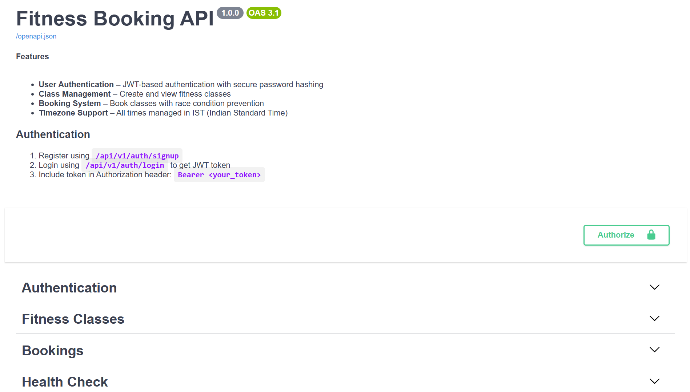
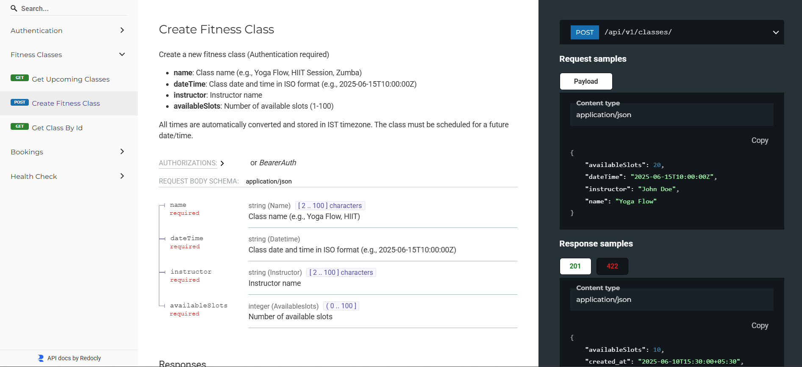

# Fitness Booking API

## 🧠 Objective

Build a simple Booking API for a fictional fitness studio using Python + FastAPI.

This project assesses backend development fundamentals, API design, coding best practices, problem-solving, and database handling.

---

## 🛠️ Tech Stack

- Language: Python  
- Framework: FastAPI  
- Database: MongoDB  
- ORM/Tools: Motor async driver for MongoDB
- Authentication: JWT Token-based authentication  

---

## 📖 Scenario

A fictional fitness studio offers multiple classes such as Yoga, Zumba, HIIT, etc.

Users must first sign up and log in. Once authenticated, they can:

- View all upcoming classes  
- Create new classes  
- Book available classes  
- View their own bookings  

---

## 🎯 Tasks and Features

### User Authentication

- Signup (`POST /api/v1/auth/signup`) with name, email, password  
- Login (`POST /api/v1/auth/login`) with email, password — returns JWT token  
- Use JWT token in `Authorization: Bearer <token>` for authenticated requests  

### Classes Management

- Create class (authenticated) `POST /api/v1/classes`  
- Get all upcoming classes `GET /api/v1/classes`  

### Bookings Management

- Book a class slot (authenticated) `POST /api/v1/bookings`  
- View all user bookings (authenticated) `GET /api/v1/bookings`  

---

## 📦 API Endpoints Summary

| Method | Endpoint                 | Description                              | Auth Required | Request Body                                        |
| ------ | ------------------------ | -------------------------------------- | ------------- | -------------------------------------------------- |
| POST   | `/api/v1/auth/signup`    | Register new user                       | No            | `{ "name": "", "email": "", "password": "" }`      |
| POST   | `/api/v1/auth/login`     | Login user and get JWT token            | No            | `{ "email": "", "password": "" }`                   |
| POST   | `/api/v1/classes`        | Create new fitness class                | Yes           | `{"name": "", "dateTime": "", "instructor": "", "availableSlots": 0}`|
| GET    | `/api/v1/classes`        | Get all upcoming fitness classes        | No            | None                                               |
| POST   | `/api/v1/bookings`       | Book a slot in a class                  | Yes           | `{ "class_id": "", "client_name": "", "client_email": "" }` |
| GET    | `/api/v1/bookings`       | Get all bookings for authenticated user| Yes           | None                                               |

---

## 📁 Folder Structure

```
fitness-booking-api/
│
├── app/                        # Main app source code
│   ├── routers/                # API route definitions (auth.py, classes.py, bookings.py)
│   ├── services/               # Core business logic
│   ├── schemas/                # Pydantic request/response models
│   ├── utils/                  # Helper modules (timezone, security)
│   ├── middleware/             # Middleware for logging, CORS, etc.
│   └── main.py                 # FastAPI app instance and startup
│
├── tests/                      # Unit and integration tests (optional)
├── requirements.txt            # Python dependencies
├── .env                       # Environment variable config
└── README.md                   # This documentation file
```

---

## ⚙️ Setup Instructions

### Prerequisites

- Python 3.8 or higher  
- Running MongoDB instance (local or MongoDB Atlas cloud)  

### Installation Steps

```
git clone https://github.com/your-username/fitness-booking-api.git
cd fitness-booking-api

python -m venv env
source env/bin/activate  # Windows: env\Scripts\activate

pip install -r requirements.txt
```

### Environment Variables

Create a `.env` file:

```
SECRET_KEY=your_super_secret_jwt_key
ALGORITHM=HS256
MONGO_URI=mongodb://localhost:27017
```

Update your `.env` values accordingly.

---

## 🚀 Running Locally

Start the FastAPI server with autoreload:

```
uvicorn app.main:app --reload
```

Open your browser and navigate to:

- API docs & testing UI: http://127.0.0.1:8000/docs  
- ReDoc alternative docs: http://127.0.0.1:8000/redoc  

---

## 📡 API Usage Examples

### Signup New User

```
curl -X POST "http://127.0.0.1:8000/api/v1/auth/signup" \
-H "Content-Type: application/json" \
-d '{"name":"John Doe","email":"john@example.com","password":"securepass123"}'
```

### Login and Get Token

```
curl -X POST "http://127.0.0.1:8000/api/v1/auth/login" \
-H "Content-Type: application/json" \
-d '{"email":"john@example.com","password":"securepass123"}'
```

### Get User Info (with JWT Token)

```
curl -X GET "http://127.0.0.1:8000/api/v1/auth/me" \
-H "Authorization: Bearer <your_token>"
```

### Create Fitness Class

```
curl -X POST "http://127.0.0.1:8000/api/v1/classes" \
-H "Content-Type: application/json" \
-H "Authorization: Bearer <your_token>" \
-d '{
  "name": "Yoga Flow",
  "dateTime": "2025-06-15T10:00:00+05:30",
  "instructor": "Jane Smith",
  "availableSlots": 20
}'
```

### Book a Class Slot

```
curl -X POST "http://127.0.0.1:8000/api/v1/bookings" \
-H "Content-Type: application/json" \
-H "Authorization: Bearer <your_token>" \
-d '{
  "class_id": "<class_id_here>",
  "client_name": "Alice",
  "client_email": "alice@example.com"
}'
```

### View My Bookings

```
curl -X GET "http://127.0.0.1:8000/api/v1/bookings" \
-H "Authorization: Bearer <your_token>"
```

---

## 📸 Screenshots

### Swagger UI Homepage



### API Documentation & Testing



*(Add your actual screenshots under `/screenshots` folder or similar)*

---

## 📝 Notes

- All date-times are stored and processed in IST (Indian Standard Time) timezone.  
- Incoming date-time inputs with different timezones are converted to IST internally.  
- MongoDB is used as a NoSQL database with Motor async driver (no SQL ORM).  
- JWT token authentication secures protected endpoints.  
- Passwords are hashed using bcrypt via Passlib.  
- Error handling covers missing fields, overbooking, invalid requests, and authentication failures.  
- Bonus includes basic logging and Swagger auto-generated docs.

---

## 🧪 Testing

- Write tests inside the `tests/` folder with `pytest`.  
- Run tests using:  
```
pytest
```


---
